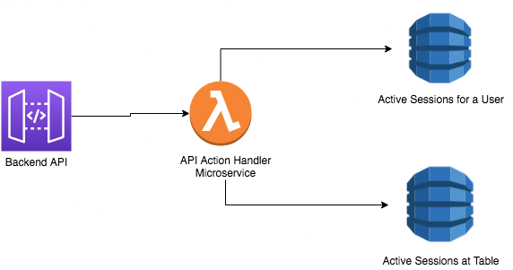
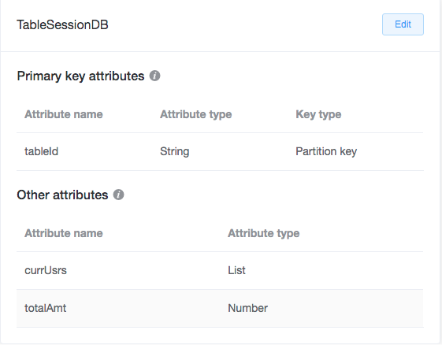
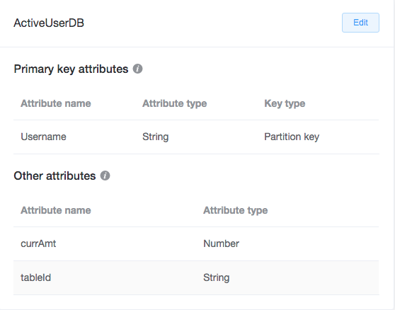

# Checkmate API Backend Instructions

## API Calls

There are a multitude of API calls currently included for the lambda. All of the API calls will have at least 2 of the four API query parameters listed below:
* `action` - this one is required for all calls, see more below
* `tablename` - the table id of the table you want to request
* `username` - the user id of the user you want  to request
* `amount` - numeric amount to add or delete from user budget as well as current tab

The actions determine what operation the microservice should do. Here are the following actions:
* `adduser` - adds a user to a table session, as well as activates the user session. If the user is not in the user session database, it will add the user
    * additionally requires `username`, `tablename`
* `changeamt` - changes current amount that user will contribute to the tab in an active session
    * additionally requires `username`
* `additem` - adds amount to total table tab, corresponds to menu item being added
    * additionally requires `tablename`
* `deleteitem` - deletes amount from total table tab, corresponds to menu item being removed
    * additionally requires `tablename`
* `finish` - closes out active session at table, returns back final bill split if successful
    * additionally requires `tablename`
* `breakdown` - returns current amount of money each user at the table is contributing
    * additionally requires `tablename`
* `total` - returns current tab amount at a table
    * additionally requires `tablename`

The query string will look like this: `GET <api_domain>/apicall?action=<action>&username=<user_id>&tablename=<table_id>&amount=<amount>`. I would like to keep the API domain domain confidential (I wll give it separately) and only add the appropriate query string. It is not necessary to use all four like I did in this example.

## Backend Schematics

Here is the basic architecture for the backend databases and API:

As you can notice, there are two DynamoDB databases that store table sessions and user sessions. These are the called the `TableSessionDB` and the `ActiveUserDB` databases respectively. 

Here is the schema for the `TableSessionDB` database:

And here is the schema for the `ActiveUserDB` database:

To look at the code for the mircoservice handler, check out `lambda_api_handler.py`. Ignore all the CloudFormation code as that ended up not being used.

